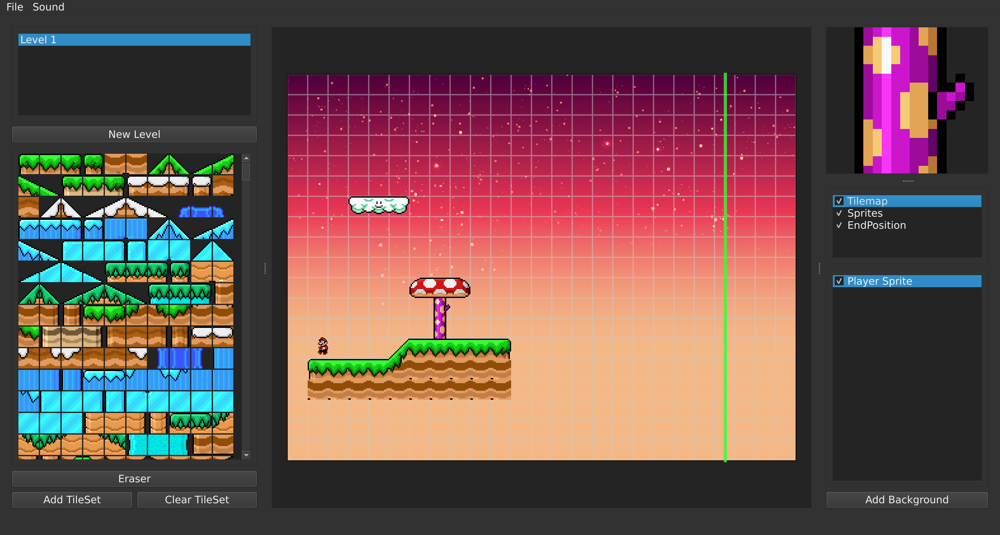

<h1 align="center">Level Editor</h1>

*<p align="center">A 2D tile-based level editor for desktop and the web</p>*

<p align="center">
  <a href="https://en.cppreference.com/w/cpp/17"></a>
  <a href="https://www.qt.io/"></a>
  <a href="https://webassembly.org/"></a>
  <a href="https://lagmoellertim.github.io/university-level-editor/"></a>
</p>




A 2D tile-based level editor built with C++ and Qt 6. Originally created as a desktop application for a university practical course, later ported to WebAssembly so it runs directly in the browser.

[**Open Live Demo**](https://lagmoellertim.github.io/university-level-editor/)

## Background

We built this project during a two-week practical computer science course at university. Three of us crammed into one room coding all day, while another friend cooked for us so we didn't have to stop working. 🫠

Originally developed against native Qt, the codebase was later upgraded to Qt 6 and compiled to WebAssembly using Emscripten.

## Features

- **Tilesets & Tilemaps**: Import tileset images, slice them into tiles, and paint across multiple ordered layers on a grid canvas.
- **Sprites & Entities**: Place, position, and inspect sprites and interactive game objects with custom properties.
- **Background Layers**: Multi-layer background canvas with parallax scrolling support and visibility controls.
- **Audio**: Add and preview background music and sound effects.
- **HDF5 Storage**: Saves levels, tilesets, sprites, and audio into self-contained `.h5` files using [HighFive](https://github.com/BlueBrain/HighFive).
- **Cross-Platform**: Builds natively for desktop (macOS, Linux, Windows) and for the web via WebAssembly.

## Building

### Prerequisites

- CMake 3.16+
- C++17 compiler (Clang, GCC, MSVC)
- Qt 6 (Core, Gui, Widgets, Multimedia)
- HDF5 library (with C, C++, and High-Level components)

### Native Desktop Build

```bash
# Clone the repository
git clone --recursive https://github.com/lagmoellertim/university-level-editor.git
cd university-level-editor

# Configure and build
cmake -B build -DCMAKE_BUILD_TYPE=Release
cmake --build build --parallel

# Run the editor
./build/editor
```

### WebAssembly Build

Building for WebAssembly requires the Qt 6 WASM toolchain and Emscripten:

```bash
# Configure with Qt's CMake wrapper
path/to/qt6/wasm_singlethread/bin/qt-cmake -B build-wasm -DCMAKE_BUILD_TYPE=Release

# Build targets (editor.html, editor.js, editor.wasm)
cmake --build build-wasm --parallel
```

*Note: CMake automatically fetches prebuilt HDF5 WebAssembly binaries during configuration when targeting Emscripten.*

## Authors

- Gerrit Kruse ([@grit6217](https://github.com/grit6217))
- Patrice Wietmaier ([@pwiet01](https://github.com/pwiet01))
- Tim-Luca Lagmöller ([@lagmoellertim](https://github.com/lagmoellertim))

## Donations / Sponsors

I'm part of the official GitHub Sponsors program where you can support me on a monthly basis.

<a href="https://github.com/sponsors/lagmoellertim" target="_blank"></a>

You can also contribute by buying me a coffee (this is a one-time donation).

<a href="https://ko-fi.com/lagmoellertim" target="_blank"></a>

Thank you for your support!

## Have fun 🎉